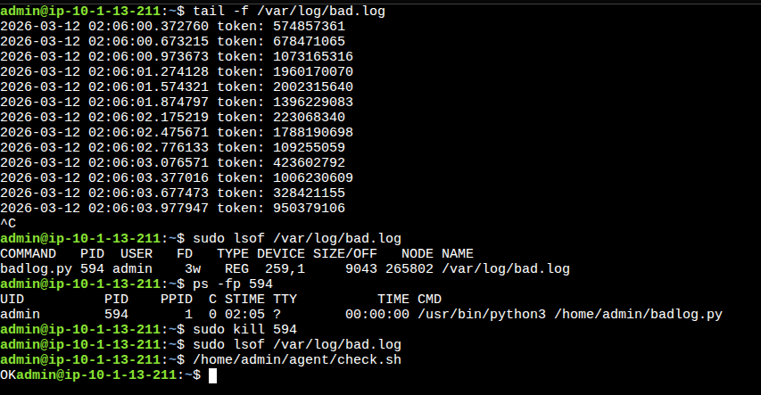

# 1. "Saint John": what is writing to this log file?
```
Scenario: "Saint John": what is writing to this log file?

Level: Easy

Description: A developer created a testing program that is continuously writing to a log file /var/log/bad.log and filling up disk. You can check for example with tail -f /var/log/bad.log.
This program is no longer needed. Find it and terminate it. Do not delete the log file.

Test: The log file size doesn't change (within a time interval bigger than the rate of change of the log file).

The "Check My Solution" button runs the script /home/admin/agent/check.sh, which you can see and execute.

Time to Solve: 10 minutes.

OS: Debian 11

Root (sudo) Access: Yes
```


- use `lsof` or `fuser` to find which process is using the file
- confirm the process with the pid
- kill it by specifying the pid